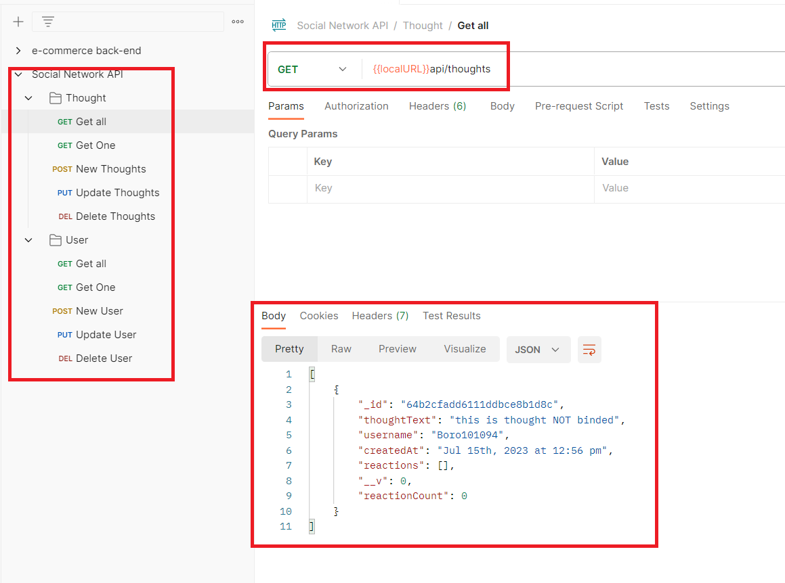
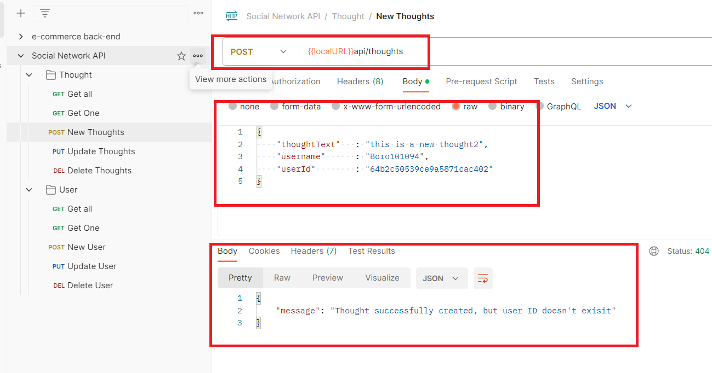
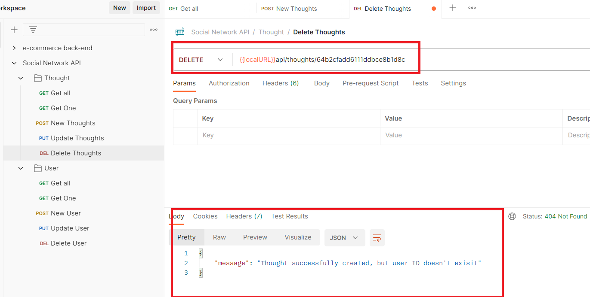

# Social-Network-API

## Description
This appplication contains an API that simulates a basic API that support the CRUD opperations for an social network.

The API will let the user create, delete, update, get all and get one elements from the DB.

## Installation

This application uses the following packages:
    express
    mongoose
    moment

To install all the dependecies run:

npm i 

OR 

Install all the packages one by one

## Usage

To run the following app run the following command:

node server.js

OR

nodemon server.js

You can test the endpoints with: postman or insomnia

## Contact Information

    GitHub: boro101094
    Email: boro101094@gmail.com

## Screenshots

Get all 

Create a new element

Delete an element

## Usage Video
https://drive.google.com/file/d/1vfHIU143S011WmJy-R-jy6m6CMWOILfl/view?usp=sharing

